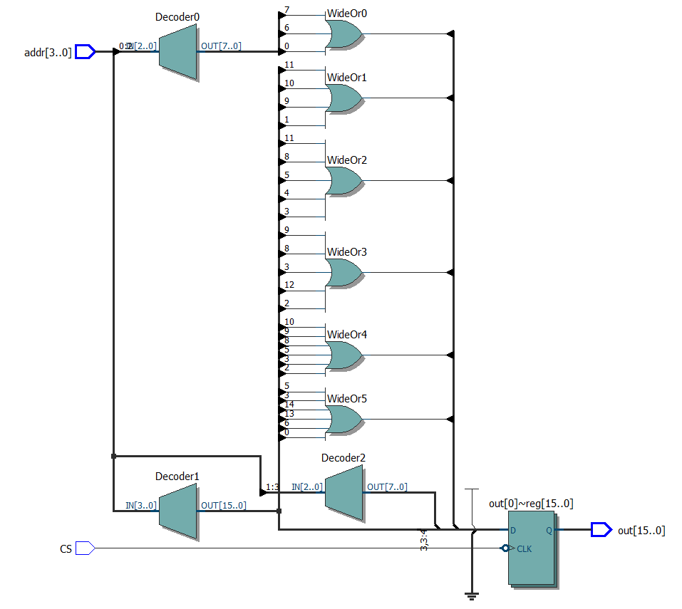
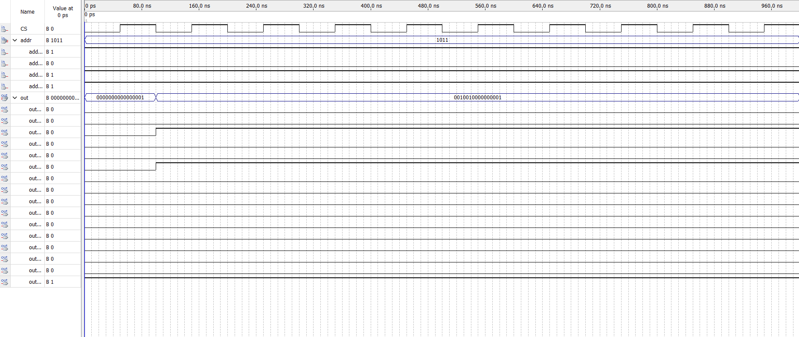

# Experiment--10-Programmable-logic-devices-
 
### AIM: To implement PROM using verilog and validate its output 
### HARDWARE REQUIRED:  – PC, Cyclone II , USB flasher
### SOFTWARE REQUIRED:   Quartus prime
### THEORY 

 
PROM (Programmable Read-Only Memory) is a type of ROM that is written only. It was meant to fulfill the requirement of a group of ROMs which may contain a selected memory content. It’s memory is written just the once and programmed electrically by the user at the time or when the initial chip fabrication. the required content file is equipped by the user and inserted within the machine referred to as storage coder. There exist a fuse at every programmable association and it’s blown once the association isn’t required.
PROM is primarily meant for smaller productions that require some initial programming. With PROM, the memory chips cannot be improved when they become obsolete. That, plus other limitations, has made PROM a somewhat phased-out type of product and technology in the catalogs of some of today's vendors. In many cases, PROM has been replaced by other methods that involve more flexibility, such as Electronically Erasable Programmable Read-Only Memory (EEPROM).

A process known as "burning the PROM" blows fuses for bit settings, rendering them unchangeable.

Figure -01 PROM 
 
 
### Procedure
### Step 1:
Open Quartus II and select new project and choose the file location.

### Step 2:
Module Declaration. Module should have the file name.

### Step 3:
Input-Output Delecaration.

### Step 4:
Use begin declaration to define the functionality of logic circuits.

### Step 5:
At the end give endmodule.

### Step 6:
Run the program and choose RTL viewer to get RTL realization.

### PROGRAM 
~~~
Program for PROM 
Developed by: Anusha R
RegisterNumber:  212221230006
~~~
~~~
module rom(out, addr, CS);
output[15:0] out;
input[3:0] addr;
input CS;
reg [15:0] out;
reg [15:0] ROM[15:0];
always @(negedge CS)
begin
ROM[0]=16'h5601; ROM[1]=16'h3401;
ROM[2]=16'h1801; ROM[3]=16'h0ac1;
ROM[4]=16'h0521; ROM[5]=16'h0221;
ROM[6]=16'h5601; ROM[7]=16'h5401;
ROM[8]=16'h4801; ROM[9]=16'h3801;
ROM[10]=16'h3001; ROM[11]=16'h2401;
ROM[12]=16'h1c01; ROM[13]=16'h1601;
ROM[14]=16'h5601; ROM[15]=16'h5401;
out=ROM[addr];
end
endmodule
~~~
### RTL LOGIC 
 
### TIMING DIGRAMS  

### RESULTS 
PROM has been implemented using verilog and output has been validated.
